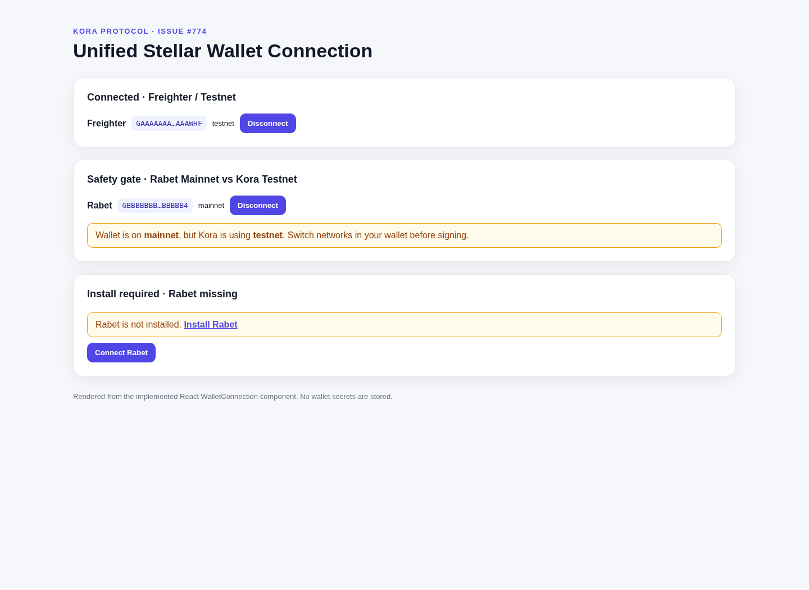

# Kora Protocol Web Application (`apps/web`)

Responsive mobile-first user interface and front-end integration layer for Kora Protocol.

## Implemented Features & Issues Addressed

### 1. Mobile-First Responsive Layout (`#781`)
- **Core Flows**: Mobile-first components built for invoice submission, marketplace browsing, fractional funding, and SME repayment.
- **Viewport Matrix**: Fully responsive from narrow mobile devices (320px width) up through desktop viewports.
- **Components**: `Header`, `Navigation`, `MobileDrawer`, `Layout`, `InvoiceSubmissionFlow`, `MarketplaceBrowsingFlow`, `FundingFlow`, `RepaymentFlow`.

### 2. In-App Notification Center (`#782`)
- **Features**: Bell icon with unread badge counter, slide-over notification panel, category filtering (Funding Milestones, Due Date Warnings, System Alerts, Governance), mark as read / mark all as read, and user preferences management.
- **Components**: `NotificationCenter`, `NotificationPanel`, `NotificationContext`, `notificationService`.

### 3. Currency & Locale Switcher (`#784`)
- **African Market Support**: Local currency converter supporting USD (USDC), NGN (Naira), KES (Shilling), ZAR (Rand), GHS (Cedi).
- **Canonical Display**: Always presents canonical on-chain settlement amounts (USDC) alongside converted local amounts.
- **Stale Data Indicator**: Automatically flags FX rates older than 1 hour as stale.
- **i18n Support**: Locale context with English (`en`), Swahili (`sw`), French (`fr`), Yoruba (`yo`), and Hausa (`ha`).
- **Components**: `CurrencySwitcher`, `LocaleSwitcher`, `FormattedAmount`, `LocaleContext`, `CurrencyContext`, `fxService`.

### 4. Transaction Simulation Preview (`#785`)
- **Pre-Flight Inspection**: Simulates Soroban smart contract calls prior to opening wallet signature prompts.
- **Decoded State Changes**: Provides human-readable previews of wallet balances, escrow changes, and protocol fee deductions.
- **Failure Blocking**: Blocks signature prompts when a transaction simulation fails or exceeds limits, preventing wasted gas and failed executions.
- **Components**: `SimulationPreviewModal`, `SimulationResultView`, `SimulationContext`, `simulationService`.

### 5. Unified Stellar Wallet Connection (`#774`)
- **Adapters**: A shared `WalletAdapter` contract supports Freighter and Rabet without coupling consuming components to extension-specific APIs.
- **Explicit states**: disconnected, connecting, connected, install-required, network-mismatch, and error are exposed through `WalletProvider` / `useWallet`.
- **Network safety**: Known mainnet/testnet mismatches are surfaced before signing; an unknown wallet network fails closed instead of being treated as compatible.
- **Session recovery**: Only the last wallet choice is persisted. Freighter can restore an already-authorized session without prompting; Rabet reconnect remains an explicit user action.
- **Account changes**: Freighter wallet-change monitoring and Rabet `accountChanged` / `networkChanged` events update the active address/network mid-session.
- **No secrets persisted**: Kora never stores wallet private keys, seed phrases, signed XDR, or account credentials in local storage.
- **SDK handoff**: Configure the Kora SDK with its `TESTNET` or `MAINNET` network config matching the `WalletProvider expectedNetwork` value before enabling a signature flow.

```tsx
<WalletProvider expectedNetwork="testnet">
  <WalletConnection />
</WalletProvider>
```

If an extension is missing, `WalletConnection` renders the wallet's install link. If the wallet is on a different known network, it renders an alert instructing the user to switch networks before signing. Freighter uses the official `@stellar/freighter-api` package; Rabet uses its documented injected `window.rabet` provider.



### 6. Wave Contributor Dashboard
- **Public Transparency**: Tracks Wave-style contributor initiatives with full visibility from GitHub to on-chain payouts.
- **Issue Tracking**: Real-time sync with GitHub issues, complexity-based points (Low: 50, Medium: 100, High: 200), status tracking.
- **Payout Transparency**: Cross-references GitHub issues with on-chain treasury disbursements, shows transaction hashes.
- **Contributor Leaderboard**: Rankings by total points earned, completed issues, disbursed vs pending payouts.
- **Program Statistics**: Completion rates, disbursement rates, active contributor counts, visual breakdowns.
- **Components**: `WaveDashboard`, `WaveIssueList`, `ContributorLeaderboard`, `WaveStatsOverview`, `waveService`.
- **Documentation**: See `README_WAVE.md` for detailed guide.

## Verification & Testing
Run unit tests and verification via:
```bash
cd apps/web
node tests/runTests.js
```
